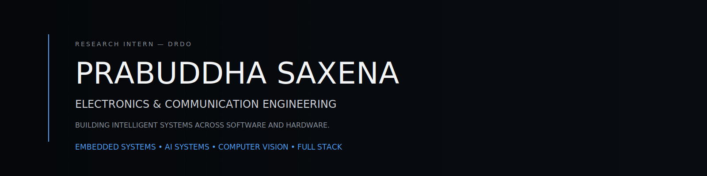

<p align="center">
  
</p>

---

## ABOUT

I build things that sit at the boundary of hardware and software — computer vision pipelines, full-stack platforms, and embedded systems. Currently at DRDO SSPL working on applied electronics research. <br><br>
`Embedded Systems` &nbsp; `AI Systems` &nbsp; `Computer Vision` &nbsp; `Full Stack` &nbsp; `Open Source`

---

## EXPERIENCE

**Research Intern** — Solid State Physics Laboratory, DRDO · MoD, Govt. of India `2026 → PRESENT`
> Embedded systems · Delhi
 
**B.E. Electronics & Communication** — JIIT Noida `2024 – 2028`
> GPA 8.3 · DSA, Signals & Systems, Digital Circuit Design, Computer Vision
 

---

## TECHNOLOGIES

### Languages


### Embedded & Electronics


### AI & Computer Vision


### Software


---

## PROJECTS

### FactGuard — AI Scam Detection Platform

> React · Node.js · RAG · Groq · LLMs

- AI-powered scam detection and fact-checking platform
- Web application, browser extension, WhatsApp bot, and PWA
- Reduced API consumption through intelligent caching

---

### Hardware Component Detector

> YOLOv8 · OpenCV · Python

- Custom computer vision pipeline for hardware component detection
- Achieved **0.965 mAP@50**
- Real-time webcam inference

---

### Precision Signal Chain Design

> STM32 · DAC · ADC · SPI · Embedded Systems

- High-precision embedded hardware platform
- Focused on mixed-signal design and isolated communication
- Modular architecture for future PCB integration

---

### Mac OS Portfolio

> HTML · CSS · JavaScript

- Desktop-inspired portfolio experience
- Custom window management and UI interactions
- Built entirely with vanilla JavaScript

---

## STATISTICS

<p align="center">
  
</p>

<p align="center">
  
</p>

---

## CONNECT

[](https://www.linkedin.com/in/prabuddha-saxena/)
[](https://github.com/prabuddha0204)
[](mailto:prabuddha02.04@gmail.com)

*Building intelligent systems across software and hardware.*
```
